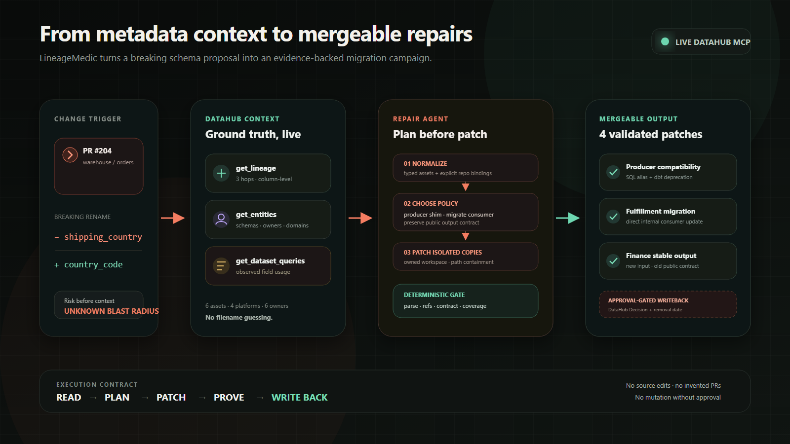
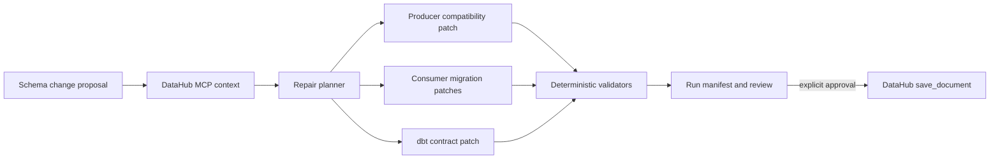

# LineageMedic

**Renovate for breaking data changes.** LineageMedic turns a proposed schema rename into a lineage-grounded, cross-repository repair campaign that teams can review before the breaking change merges.

Built for the [DataHub Agent Hackathon](https://datahub.devpost.com/) and released under Apache 2.0.

## Judge it in 90 seconds

| What to verify | Direct evidence |
| --- | --- |
| Working product | [Public no-login replay](https://14188769700lbk-dev.github.io/lineage-medic/) |
| Under-three-minute walkthrough | [2:45 demo video](https://youtu.be/WohjWxcAYfo) |
| Real DataHub MCP reads | [Sanitized live run manifest](examples/evidence/live-datahub-read-run.json) |
| Approval-gated DataHub writeback | [Persisted-URN proof](examples/evidence/live-datahub-writeback.json) and [DataHub Decision](docs/assets/datahub-decision.jpg) |
| Mergeable generated code | [Four-file repair PR #1](https://github.com/14188769700lbk-dev/lineage-medic/pull/1) with a successful check |
| Open-source contribution | [DataHub Skills PR #36](https://github.com/datahub-project/datahub-skills/pull/36) |

The [judge testing guide](docs/judge-testing.md) gives a 90-second public path, a credential-free local run, and the live DataHub MCP setup.

## Why it exists

Impact analysis can tell you that a field has consumers. It usually stops before the expensive part: coordinating the migration and producing changes that each owning team can merge.

LineageMedic closes that gap. For the included `shipping_country → country_code` scenario it:

1. Calls DataHub's `get_lineage`, `get_entities`, and `get_dataset_queries` MCP tools.
2. Combines column lineage with repository bindings and observed production queries.
3. Plans a compatibility window instead of a flag-day rename.
4. Copies three repositories into an isolated run workspace and edits four real files.
5. Parses the changed SQL, resolves dbt `ref()` calls, verifies the dbt contract, and checks repair coverage against the lineage result.
6. Creates an auditable run manifest and a DataHub decision document.
7. Keeps `save_document` behind an explicit mutation approval gate.

This is intentionally more than a chat answer, a lineage viewer, or a PR comment. The output is a reproducible set of mergeable artifacts plus the evidence that justified them.

## The bounded agent loop

LineageMedic is a tool-using code-generation agent with a deliberately constrained loop:

**observe** through DataHub MCP → **plan** an owner-specific migration → **act** on isolated repository copies → **prove** every generated change → **remember** the approved decision in DataHub.

Its planner is deterministic by design. Compatibility policy, repair coverage, and external mutation are review boundaries, so an unconstrained model cannot silently invent a repository, skip a downstream asset, or bypass the approval gate. DataHub context still changes the generated code: the producer receives an alias, an internal consumer migrates directly, and a public-contract consumer changes its input while keeping its output stable.

## Try it in 60 seconds

Requirements: Node.js 22.13+ (Node 24 is used in CI).

```bash
npm ci
npm run demo
```

The command writes only beneath `.lineage-medic/runs/LM-204/` and prints the validation result. Inspect:

- `.lineage-medic/runs/LM-204/workspace/` — copied repositories with generated repairs
- `.lineage-medic/runs/LM-204/run-manifest.json` — tool traces, query evidence, patches, checks, and writeback state
- `.lineage-medic/runs/LM-204/datahub-decision.md` — the decision prepared for DataHub

Run the visual demo:

```bash
npm run dev
```

Open [http://127.0.0.1:5173](http://127.0.0.1:5173), then select **Run guided repair**.

## What the demo actually changes

| Repository | File | Generated strategy |
| --- | --- | --- |
| `fiction-retail/warehouse` | `models/core/orders.sql` | Add a temporary `shipping_country` compatibility alias beside `country_code` |
| `fiction-retail/warehouse` | `models/core/orders.yml` | Add the replacement field and mark the legacy contract field deprecated |
| `fiction-retail/fulfillment-analytics` | `models/marts/shipping_performance.sql` | Migrate the consumer to `country_code` |
| `fiction-retail/finance-metrics` | `models/revenue/revenue_by_market.sql` | Read `country_code` while preserving the public `shipping_country` output |

The scenario is based on DataHub's official [Fiction Retail datapack](https://github.com/datahub-project/static-assets/tree/main/datasets/fiction-retail). The small code repositories in this project are original, synthetic consumers created for the migration demonstration.

[Browse the checked-in generated campaign](examples/generated/LM-204/) to inspect the final SQL, dbt contract, and DataHub Decision document without running the application. Complete before/after patches remain in the [live evidence manifest](examples/evidence/live-datahub-read-run.json), and the same four generated artifacts are published in [repair PR #1](https://github.com/14188769700lbk-dev/lineage-medic/pull/1) with a successful CI check.

## Judge it without credentials

[Open the public hosted replay](https://14188769700lbk-dev.github.io/lineage-medic/).

[Watch the 2:45 public demo video](https://youtu.be/WohjWxcAYfo) for the judge-first walkthrough of live DataHub MCP reads, generated repairs, validation, the real GitHub pull request, and the approval-gated DataHub Decision writeback.

The deployable web build replays a checked-in capture from a real self-hosted DataHub Quickstart run through the official MCP server. It returns the same four patches and validation evidence produced by the local engine, while remaining stateless and safe for public judging. The interface labels the context as a recorded run, never claims a live tenant connection, and keeps `save_document` disabled.

The sanitized [live run manifest](examples/evidence/live-datahub-read-run.json) proves the MCP transport, tool arguments, raw DataHub responses, normalized query evidence, generated patches, and validation gates used by that run. It contains no token, hostname, local path, or private metadata.

Fastest review path:

1. Open the hosted replay and select **Run guided repair**.
2. Open any generated patch and inspect the evidence timeline.
3. Inspect [repair PR #1](https://github.com/14188769700lbk-dev/lineage-medic/pull/1) and compare it with the checked-in live manifest.
4. Run `npm ci && npm run demo` for a credential-free local reproduction.

The full local application remains the source of truth for fixture execution and live MCP modes. Build the hosted replay with:

```bash
npm run build:site
npm run build:pages
```

## DataHub modes

Fixture mode is the default and requires no account. It replays a checked-in snapshot of the official MCP tool contract, never claims a live connection, and never performs a DataHub mutation.

### DataHub Cloud over HTTP

```bash
LINEAGE_MEDIC_MODE=mcp-http
DATAHUB_MCP_URL=https://your-tenant.acryl.io/integrations/ai/mcp/
DATAHUB_MCP_TOKEN=your_personal_access_token
```

### Self-hosted DataHub over stdio

Install `uv`, then use the official MCP server through `uvx`:

```bash
LINEAGE_MEDIC_MODE=mcp-stdio
DATAHUB_GMS_URL=http://localhost:8080
DATAHUB_GMS_TOKEN=your_personal_access_token
DATAHUB_MCP_COMMAND=uvx
```

The adapter launches `mcp-server-datahub@latest`. See [DataHub's MCP guide](https://docs.datahub.com/docs/features/feature-guides/mcp) and [live setup notes](docs/live-datahub-setup.md).

## Architecture





The repair engine is deterministic by design; no proposal source can bypass the validators or mutation gate. See [architecture.md](docs/architecture.md) for the component boundaries and threat model.

## Open-source contribution

The project also contributed [DataHub metadata audit skill PR #36](https://github.com/datahub-project/datahub-skills/pull/36) to the official `datahub-skills` repository. The contribution implements the previously referenced but missing `datahub-audit` workflow, including evidence-grounded coverage metrics, a reusable report template, routing metadata, and validation. This is independent of LineageMedic's application code and gives the wider DataHub agent ecosystem a reusable audit capability.

## Verification

```bash
npm run verify
```

Current automated checks cover:

- repeatable repository copying and file modification;
- SQL parsing after deterministic rendering of `source()` and `ref()` macros;
- cross-project dbt reference resolution;
- YAML contract compatibility and deprecation metadata;
- one repair for every code-bound lineage asset;
- fixture versus live writeback semantics;
- byte-for-byte parity between engine output and the checked-in sample campaign;
- live MCP evidence completeness and rejection of local endpoints, host paths, and authentication material.

The project deliberately labels its dbt check **dbt ref resolution**, not `dbt compile`. A full adapter can invoke `dbt compile` in repositories that provide profiles and warehouse credentials; the included offline demo makes no such claim.

## Project map

```text
src/adapters/        DataHub fixture and live MCP adapters
src/core/            Context contract, repair engine, validators, tests
src/server/          Fastify API and demo campaign
src/client/          React review interface
examples/context/    Recorded MCP evidence
examples/evidence/   Sanitized manifest from a real live MCP run
examples/generated/  Reviewable SQL, YAML, and Decision outputs
examples/repos/      Three synthetic dbt repositories
scripts/             Reproducible self-hosted DataHub demo seeding
docs/                Architecture, live setup, demo, and submission material
```

## Safety and review model

- Source examples are never edited; every run works on an owned copy.
- The engine verifies that every generated path stays inside the run workspace.
- Fixture mode cannot persist to DataHub.
- Live `save_document` calls require a separate approval action after validation.
- Repository publishing remains a downstream review step. The hosted LM-204 replay links only to the real, CI-verified [generated repair PR #1](https://github.com/14188769700lbk-dev/lineage-medic/pull/1); other runs never invent PR URLs.

## Status

The fixture path, live MCP transport, self-hosted DataHub seed, repair engine, hosted replay, UI, CI, sanitized live read-run evidence, and a real generated-repair pull request are implemented. A separate explicit approval also completed a real `save_document` call; the [sanitized writeback proof](examples/evidence/live-datahub-writeback.json), [LineageMedic result](docs/assets/datahub-writeback.jpg), and [published DataHub Decision](docs/assets/datahub-decision.jpg) record the returned document URN while the hosted replay remains stateless.

## License

Apache License 2.0. See [LICENSE](LICENSE) and [NOTICE](NOTICE).
