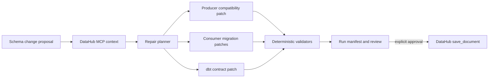

# LineageMedic

**Renovate for breaking data changes.** LineageMedic turns a proposed schema rename into a lineage-grounded, cross-repository repair campaign that teams can review before the breaking change merges.

Built for the [DataHub Agent Hackathon](https://datahub.devpost.com/) and released under Apache 2.0.

## Why it exists

Impact analysis can tell you that a field has consumers. It usually stops before the expensive part: coordinating the migration and producing changes that each owning team can merge.

LineageMedic closes that gap. For the included `shipping_country → country_code` scenario it:

1. Calls DataHub's `get_lineage`, `get_entities`, and `get_dataset_queries` MCP tools.
2. Combines column lineage with repository bindings and observed production queries.
3. Plans a compatibility window instead of a flag-day rename.
4. Copies three repositories into an isolated run workspace and edits four real files.
5. Parses the changed SQL, resolves dbt `ref()` calls, verifies the dbt contract, and checks repair coverage against the lineage result.
6. Creates an auditable run manifest and a DataHub decision document.
7. Keeps `save_document` behind an explicit mutation approval gate.

This is intentionally more than a chat answer, a lineage viewer, or a PR comment. The output is a reproducible set of mergeable artifacts plus the evidence that justified them.

## Try it in 60 seconds

Requirements: Node.js 22.12+ (Node 24 is used in CI).

```bash
npm ci
npm run demo
```

The command writes only beneath `.lineage-medic/runs/LM-204/` and prints the validation result. Inspect:

- `.lineage-medic/runs/LM-204/workspace/` — copied repositories with generated repairs
- `.lineage-medic/runs/LM-204/run-manifest.json` — tool traces, query evidence, patches, checks, and writeback state
- `.lineage-medic/runs/LM-204/datahub-decision.md` — the decision prepared for DataHub

Run the visual demo:

```bash
npm run dev
```

Open [http://127.0.0.1:5173](http://127.0.0.1:5173), then select **Run guided repair**.

## What the demo actually changes

| Repository | File | Generated strategy |
| --- | --- | --- |
| `fiction-retail/warehouse` | `models/core/orders.sql` | Add a temporary `shipping_country` compatibility alias beside `country_code` |
| `fiction-retail/warehouse` | `models/core/orders.yml` | Add the replacement field and mark the legacy contract field deprecated |
| `fiction-retail/fulfillment-analytics` | `models/marts/shipping_performance.sql` | Migrate the consumer to `country_code` |
| `fiction-retail/finance-metrics` | `models/revenue/revenue_by_market.sql` | Read `country_code` while preserving the public `shipping_country` output |

The scenario is based on DataHub's official [Fiction Retail datapack](https://github.com/datahub-project/static-assets/tree/main/datasets/fiction-retail). The small code repositories in this project are original, synthetic consumers created for the migration demonstration.

## DataHub modes

Fixture mode is the default and requires no account. It replays a checked-in snapshot of the official MCP tool contract, never claims a live connection, and never performs a DataHub mutation.

### DataHub Cloud over HTTP

```bash
LINEAGE_MEDIC_MODE=mcp-http
DATAHUB_MCP_URL=https://your-tenant.acryl.io/integrations/ai/mcp/
DATAHUB_MCP_TOKEN=your_personal_access_token
```

### Self-hosted DataHub over stdio

Install `uv`, then use the official MCP server through `uvx`:

```bash
LINEAGE_MEDIC_MODE=mcp-stdio
DATAHUB_GMS_URL=http://localhost:8080
DATAHUB_GMS_TOKEN=your_personal_access_token
DATAHUB_MCP_COMMAND=uvx
```

The adapter launches `mcp-server-datahub@latest`. See [DataHub's MCP guide](https://docs.datahub.com/docs/features/feature-guides/mcp) and [live setup notes](docs/live-datahub-setup.md).

## Architecture



The repair engine is deterministic by design. An LLM can be added as a proposal source later, but it cannot bypass the validators or mutation gate. See [architecture.md](docs/architecture.md) for the component boundaries and threat model.

## Verification

```bash
npm run verify
```

Current automated checks cover:

- repeatable repository copying and file modification;
- SQL parsing after deterministic rendering of `source()` and `ref()` macros;
- cross-project dbt reference resolution;
- YAML contract compatibility and deprecation metadata;
- one repair for every code-bound lineage asset;
- fixture versus live writeback semantics.

The project deliberately labels its dbt check **dbt ref resolution**, not `dbt compile`. A full adapter can invoke `dbt compile` in repositories that provide profiles and warehouse credentials; the included offline demo makes no such claim.

## Project map

```text
src/adapters/        DataHub fixture and live MCP adapters
src/core/            Context contract, repair engine, validators, tests
src/server/          Fastify API and demo campaign
src/client/          React review interface
examples/context/    Recorded MCP evidence
examples/repos/      Three synthetic dbt repositories
docs/                Architecture, live setup, demo, and submission material
```

## Safety and review model

- Source examples are never edited; every run works on an owned copy.
- The engine verifies that every generated path stays inside the run workspace.
- Fixture mode cannot persist to DataHub.
- Live `save_document` calls require a separate approval action after validation.
- Repository publishing and draft-PR automation are intentionally downstream review steps; the current demo does not invent PR URLs.

## Status

The end-to-end fixture path, live MCP transport, repair engine, UI, and CI are implemented. A live DataHub recording and hosted public demo will be added before the Devpost deadline.

## License

Apache License 2.0. See [LICENSE](LICENSE) and [NOTICE](NOTICE).
